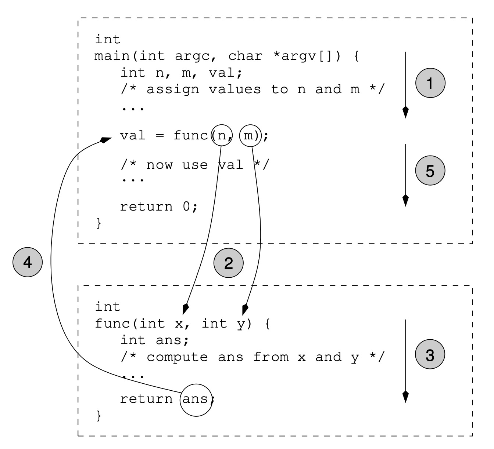

<!-- page_number: true -->

<!-- $size: A4 -->


# COMP10002 Foundations of Algorithms

## Workshop Week4  

<br>

###### Wenbin Cao
###### August 15, 2019
###### GitHub Repo: https://github.com/AlanChaw/COMP10002-FoA


---

# Recap

## Functions


 
## Pointer


## Array

--- 

# Functions


--- 

# Functions

### Declaration and Defination
</br>

### Arguments and Parameters

</br>

### Recursion

--- 

### Use of void

```c

void printHello(void){
    printf("hello\n");
}


int main(){
    printHello();
    printHello();
    printHello();
    return 0;
}
```
Output:

```c
hello
hello
hello
```


---
# Pointers
### Scope Problem

- Changing the local variable in a function will not change the outside argument

  ```c
  void func(int x){
      x++;
  }

  int main(){
      int x = 1;
      func(x);
      printf("%d\n", x);
      return 0;
  }
  ```
- Functions cannot use the local variables of other functions

---
# Discussion

### Exercise 6.2

For each point, write down a list of all of the program-declared variables and functions that are in scope at that point (and the type for each identifier). 

---

### Pointers and pointer operations
- Pointer: Stores the memory address of another variable
  ```c
  int main(){
      int a = 3;
      int* p = &a;  //p is a pointer to int
      
      printf("%d\n", a);
      printf("%p\n", &a);

      printf("%d\n", *p);
      printf("%p\n", p);

      return 0;
  }
  ```
  Output: 
  ```c
  3
  0x7ffeefbff5b8
  3
  0x7ffeefbff5b8
  ```
---
### Pointer is like an "alias" of the variable

```c
int main(){
    int a = 3;
    int* p = &a;
    
    *p = *p + 1;
    
    printf("%d\n", a);
    printf("%d\n", *p);
    
    return 0;
}
```
---

### Pointers as arguments (Call by Reference)

```c

void swap(int *p1, int *p2){
    int tmp;
    tmp = *p1;
    *p1 = *p2;
    *p2 = tmp;
}

int main(){
    int x = 2, y = 3;
    swap(&x, &y);
    printf("after swap: x=%d, y=%d\n", x, y);
    
}
```

---
### Further Example
```c
void myfunc(int *pointer){
    *pointer = *pointer + 1;
    
    int b = 10;
    pointer = &b;
    *pointer = *pointer + 1;
}

int main(){
    int a = 3;
    int* p = &a;

    printf("Before pass to function: %d\n", a);
    myfunc(p);
    printf("After executed of function: %d\n", a);

    return 0;
}
```
---
# Array

## Dicsussion - Exercise 7.3

Modify the program of Figure 7.3 on page 104 so that after the array has been sorted only the distinct values are retained in the array (with variable n suitably reduced)

---

# Hands on exercise

### Exercise 6.9

- Try to solve this question step by step
	- Copy, paste and run the program for Exercise 3.6
	- Add try_one_coin() function, and test
	- Add print_change() function, and test
	- Add round_to_5() function, and test
	- Write a loop to iterate the input from 1 to 1000 ($10)

### Exercise 7.4


