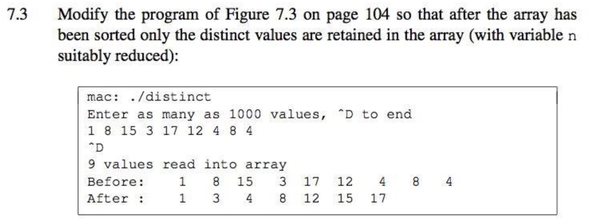
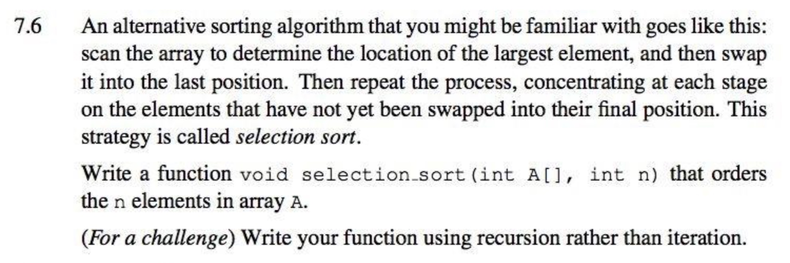
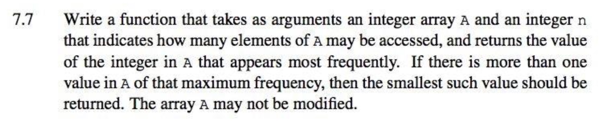
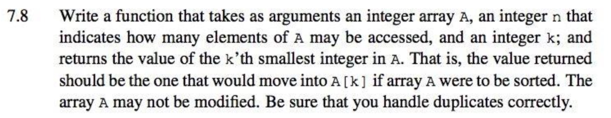
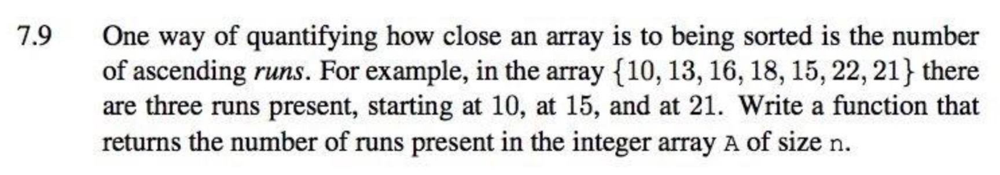
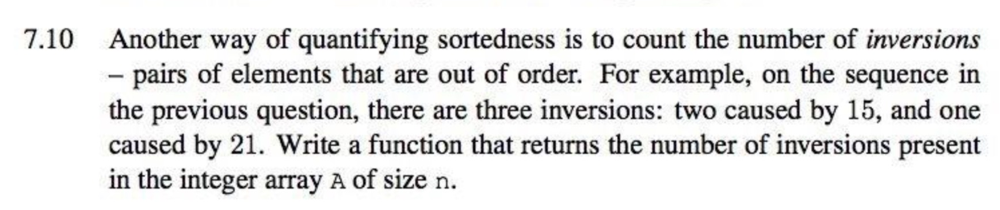

<!-- $theme: default -->

<!-- page_number: true -->

<!-- $size: A4 -->


# COMP10002 Foundations of Algorithms

## Workshop Week5  

<br>

###### Wenbin Cao
###### August 29, 2019
###### GitHub Repo: https://github.com/AlanChaw/COMP10002-FoA


---

# Recap

## Arrays
- __Array Declaration and Using__
- __Reading into an array__
- __Arrays and Functions__

## Insertion Sort

## Measuring Performance
- __Linear Search__
- __Binary Search__

--- 

# Array Declaration and Using

```C
int main(int argc, char *argv[]) {
    int A[5];
    int i;
    // array subscripts start at zero
    for (i = 0; i < 5; i++) {
        A[i] = i;
    }
    for (i = 0; i < 5; i++) {
        printf("A[%d] = %d\n", i, A[i]);
    }
    return 0;
}
```
Output:
```c
A[0] = 0
A[1] = 1
A[2] = 2
A[3] = 3
A[4] = 4
```
---
# Reading into an array
### - Array subscripts start at zero
### - Bounds checking must be done by the programmer

---
# Reading into an array
```C
int main(int argc, char *argv[]) {
    printf("Input some numbers: ");
    int N = 10, i, num;
    int A[N];
    for (i = 0; i < N; i++){  // initialize array
        A[i] = 0;
    }
    
    i = 0;
    while (scanf("%d", &num) == 1) { // get the inputs
        A[i] = num;
        i++;
    }
    
    for (i = 0; i < N; i++){  // print array elements
        printf("%d ", A[i]);
    }
    
    return 0;
}
```
---
# Reading into an array
Output:
```C
Input some numbers: 3 4 5 6 7
3 4 5 6 7 0 0 0 0 0
```
---
# Insertion Sort
### Insertion sort by visualgo.net

https://visualgo.net/bn/sorting

### C Code:
```C
void sort_int_array(int A[], int n) {
    int i, j;
    /* assume that A[0] to A[n-1] have valid values */
    for (i=1; i<n; i++) {
        /* swap A[i] left into correct position */
        for (j=i-1; j>=0 && A[j+1]<A[j]; j--) {
            /* not there yet */
            int_swap(&A[j], &A[j+1]);
        }
    }
    /* and that's all there is to it! */
}
```
---
# Discussion



---

# Exercise 7.3 - Solution
```C
int i, newn;

/* first, sort the array */
sort_int_array(A, n);
/* always accept first item into the output array */
newn = 1;
/* now do the reduction, starting at the second item, and
 bypassing items that are same as the last one already placed
 at the tail of the front part of the reduced A */
for (i=1; i<n; i++) {
    if (A[i] != A[newn-1]) {
        A[newn] = A[i];
        newn++;
    }
}
```
---
# Discussion


---
# Arrays and functions

#### - The array name is a _pointer constant_ whose value is the address of the first variable in the array.
```C
int main(int argc, char *argv[]) {
    int A[5];
    int *p;
    p = A;
    printf("address value of A is: %p\n", A);
    printf("address value of A[0] is: %p\n", &A[0]);
    printf("address value of p is: %p\n", p);
    
    return 0;
}
```
Output:
```
address value of A is: 0x7ffeefbff5a0
address value of A[0] is: 0x7ffeefbff5a0
address value of p is: 0x7ffeefbff5a0
```

---
# Arrays and functions

#### - In the function header, the array can be declared as a pointer in the function header, or as an undimensioned array.

```C
int read_int_array(int A[], int n); 
void selection_sort(int A[], int n);
```
#### - If the array elements are changed in the function, the outside original array will also be changed. 
#### - The length of the array should always be passed to the function together with the array. 

---
# Discussion


---
# Hands on exercise

## Exercise 7.8, 7.9, 7.10, 7.11, as many as you can.
## Any questions for Chapters 1-6 ?

---







