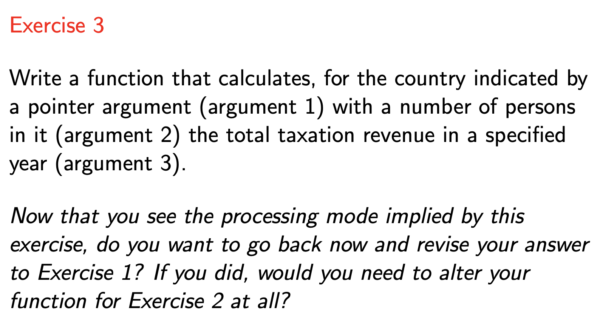

<!-- $theme: default -->

<!-- page_number: true -->

<!-- $size: A4 -->

<script type="text/javascript" async
  src="https://cdnjs.cloudflare.com/ajax/libs/mathjax/2.7.5/latest.js?config=TeX-MML-AM_CHTML">
</script>


# COMP10002 Foundations of Algorithms

## Workshop Week 9  

<br>

###### Wenbin Cao
###### September 26, 2019
###### GitHub Repo: https://github.com/AlanChaw/COMP10002-FoA


---
# Outline

### - Discussion Questions for Structs
### - Review on Dynamic Memory
### - Programming Exercises for Dynamic Memory

---
# Discussion


---
# Discussion


---
# Discussion


---
# Discussion



---
# Dynamic Memory

### - We always cannot know how much memory we need in advance.

### - The functions: 
```C
size_t sizeof(thing)  // can get either a type or a variable

void *malloc(size_t size)

void *realloc(void *ptr, size_t size)

void free(void *ptr)
```
---
# sizeof
```C
size_t sizeof(thing)
```

<div align="center">

</div>


---
# malloc
```C
void *malloc(size_t size)
```

#### Example, initialize an array dynamically
```C
int n;
printf("input the size for the integer array: ");
scanf("%d", &n);
    
int *p = (int *)malloc(n * sizeof(int));

/* do something  */
/* do something  */
/* do something  */

free(p);
p = NULL;
```

---

# realloc
```C
void *realloc(void *ptr, size_t size)
```

- Allocates a fresh segment of memory contains _size_ bytes
- Copies the memory segment indicated by _ptr_ to this new segment
- Frees the segment indicated by _ptr_

---
# realloc

#### Example, realloc sapce
```C
int original_size = 10;
int new_size = 100;

char* p = (char *)malloc(original_size);
printf("%p\n", p);

p = (char *)realloc(p, new_size);
printf("%p\n", p);
```
#### Output:
```C
0x10330b1f0
0x1033092c0
```

---

# Exercises


---
# The structure for "argc" and "argv"


---

# Exercises


