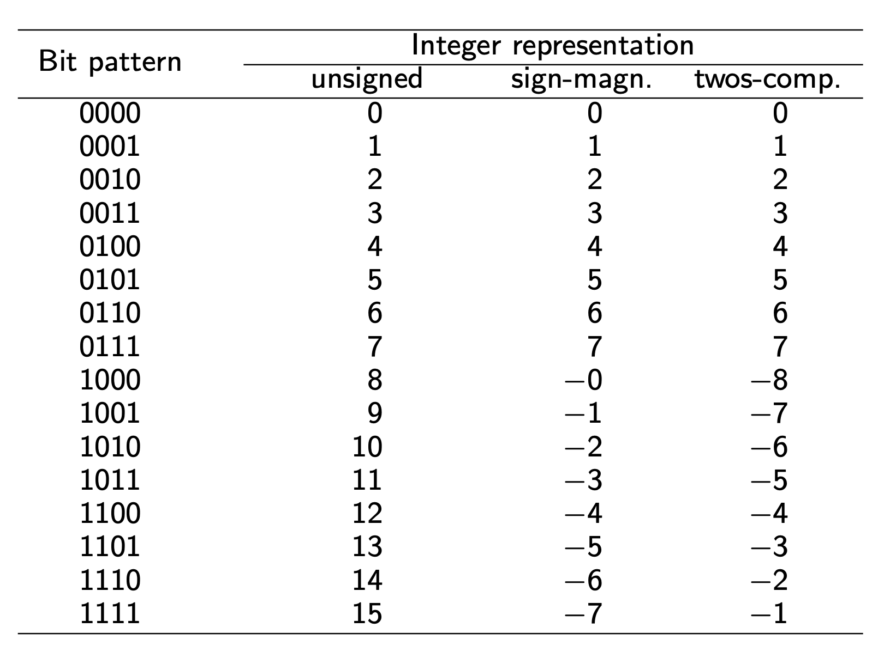

<!-- $theme: default -->

<!-- page_number: true -->

<!-- $size: A4 -->

<script type="text/javascript" async
  src="https://cdnjs.cloudflare.com/ajax/libs/mathjax/2.7.5/latest.js?config=TeX-MML-AM_CHTML">
</script>


# COMP10002 Foundations of Algorithms

## Workshop Week 11  

<br>

###### Wenbin Cao
###### October 17, 2019
###### GitHub Repo: https://github.com/AlanChaw/COMP10002-FoA


---

# Outline

## Chapter 11 - File Operations
#### - Text Files

#### - Binary Files


## Chapter 13 - Number Representations
#### - Binary Numbers
#### - Twos-Complement Representation

---
# File Operations

#### - Creating a new file
#### - Opening an existing file
#### - Closing a file
#### - Reading from a file
#### - Writing to a file

---
# Text Files
**In a text file, information is stored as a sequence of ASCII printable characters.**

#### Open, write to file, then close file.
```C
FILE* fptr;
fptr = fopen("./testFile.txt", "w");
assert(fptr != NULL);

fprintf(fptr, "hello world\n");

fclose(fptr);
```

---
# Text Files

#### Read from a file by "getc()" 
```C
char c;

FILE* fptr;
fptr = fopen("./testFile.txt", "r");
assert(fptr != NULL);

while ((c=getc(fptr)) != EOF) {
    printf("%c", c);
}

fclose(fptr);
```

---
# Text Files

#### Read from a file by "fscanf()" 

```C
char word[MAXLEN];

FILE* fptr;
fptr = fopen("./testFile.txt", "r");
assert(fptr != NULL);

while (fscanf(fptr, "%s", word) != EOF) {
    printf("%s ", word);
}

fclose(fptr);
```

---
# Binary Files

#### Write to a binary file
```C
fwrite(addressData, sizeData, numbersData, pointerToFile);
```

#### Read from a binary file
```C
fread(addressData, sizeData, numbersData, pointerToFile);
```

---

# Number Representations

#### Inside the computer, everything is stored as a sequence of binary digits, or bits.

-  **Bit**: "0" or "1".
-  **Byte**: 8 bits.
-  **Word**: 32 or 64 bits, a.k.a 4 or 8 bytes.

---
# Binary numbers

#### Binary -> Decimal
- $(1011)_2 = 1*2^3+0*2^2+1*2^1+1*2^0=11$
- $(0111)_2 = 0*2^3+1*2^2+1*2^1+1*2^0=7$


#### Decimal -> Binary
- $20=16+4=2^4+2^2=(10100)_2$
- $150 = 128+16+4+2=2^7+2^4+2^2+2^1=(10010110)_2$

---

# Binary numbers - Representations

- **Unsigned**
- **Sign-magnitude**
- **Twos-complement**

---




---

# Twos-complement representation

#### Leading bit has a weight of $-2^{w-1}$.
#### Advantages:
- Only one representation for 0.
- Integer arithmetic is easy to perform.
#### Examples:
- $5-2=5+(-2)=(0101)_2+(1110)_2=(0011)_2=3$
- $3-7=3+(-7)=(0011)_2+(1001)_2=(1100)_2=-4$

---

# Assignment 2

### - Please read the FAQ page carefully.
### - Try to make a submission everyday.
### - Do not forget to verify the output and see the result.
### - Complete the Authorship Declaration at the top of your program

---
# Assignment 2

## Segmentation fault problem

#### Why?

- Linux system (Dimefox) has a low tolerance for memory problems.
- It happens when you try to access a memory block which you are not allowed to.

#### How to solve?
- When you declare a pointer, remember to allocate memory for it.
- Make sure the memory size is calculated correctly. 
- Check if the memory is allocated successfully. (Using assert)
- When you use a pointer, make sure it is not NULL.
- Before using arrays, check if it is NULL, check if the index is out of boundary.


