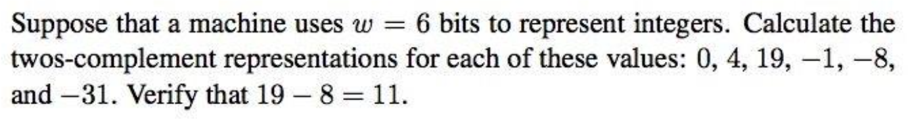
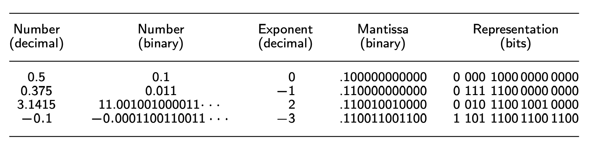
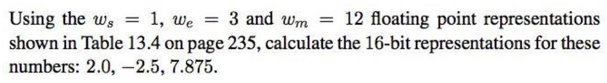
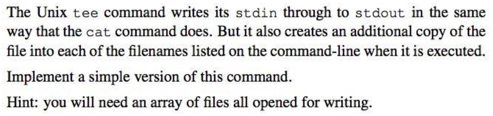
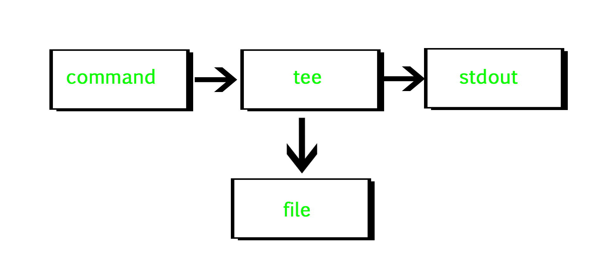

<!-- $theme: default -->

<!-- page_number: true -->

<!-- $size: A4 -->

# COMP10002 Foundations of Algorithms

## Workshop Week 12  

 

###### Wenbin Cao
###### October 24, 2019
###### GitHub Repo: https://github.com/AlanChaw/COMP10002-FoA

---

# Outline

## Chapter 13 - Number Representations
#### - Unsigned types
#### - Bit operations
#### - Floating point representations
## Chapter 9 - Problem Solving Strategies

---
# Number Representations
## Twos-complement representation

---

# Number Representations
## Unsigned types
| Type               | Range              | Format specifier |
|--------------------|--------------------|------------------|
| unsigned char      | [0, 255]           | %c               |
| unsigned short int | [0, 65,535]        | %hu              |
| unsigned int       | [0, 4,294,967,295] | %u               |
| ...       | ... | ...               |

---
# Number Representations
## Bit operations

| Symbol | Operator |
|--------|----------------------------|
| & | bitwise AND |
| \| | bitwise inclusive OR |
| ^ | bitwise XOR (exclusive OR) |
| ~ | bitwise NOT |
| << | left shift |
| >> | right shift |

---
# Number Representations
## Floating point representations

The floating point types **float** and **double** are stored as：
- a one-bit sign
- a $w_e$-bit integer exponent
- a $w_m$-bit mantissa, the leading digit is non-zero

---
# Number Representations
## Floating point representations

---

## Floating point representations

---
# Problem Solving Strategies

#### - Generate and test
#### - Divide and conquer
#### - Simulation
#### - Approximation
#### - Adaptation

---
# Exercise

---

# Tutor feedback

### https://apps.eng.unimelb.edu.au/casmas/index.php?r=qoct/subjects