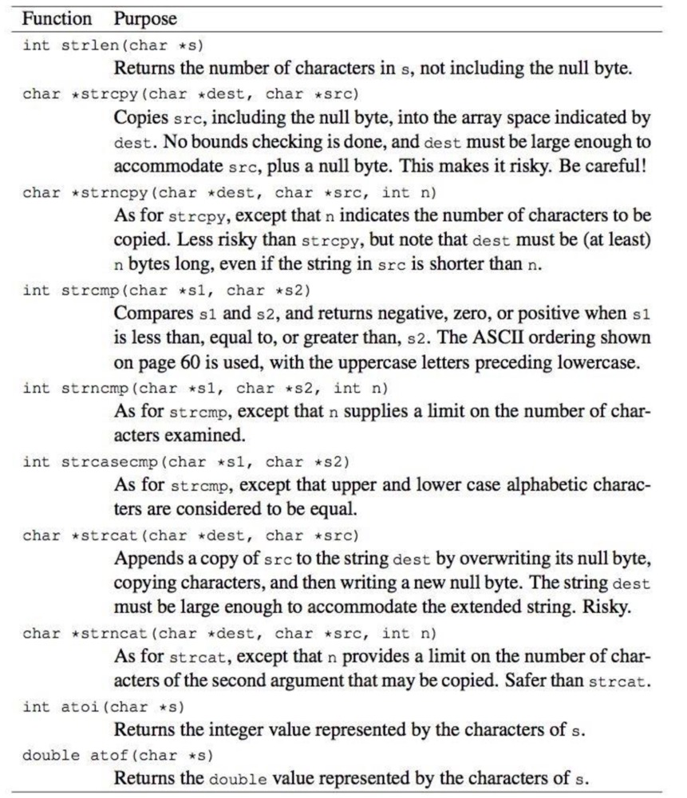
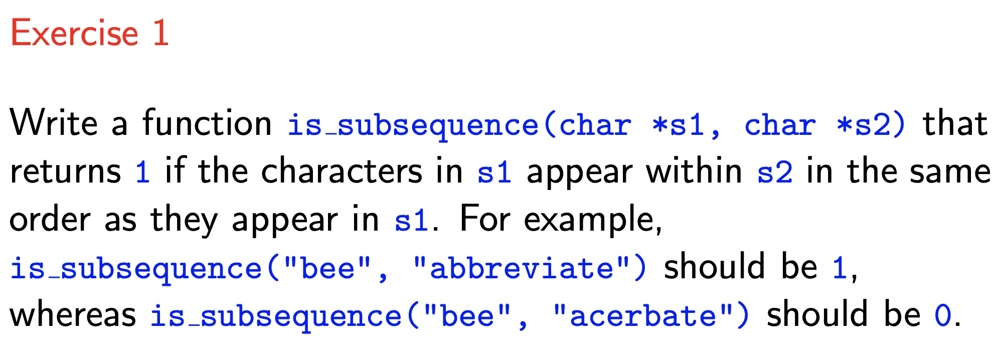
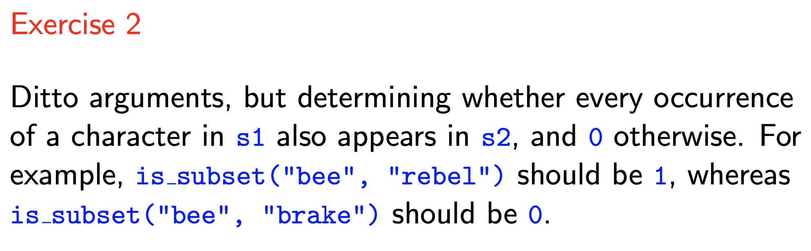
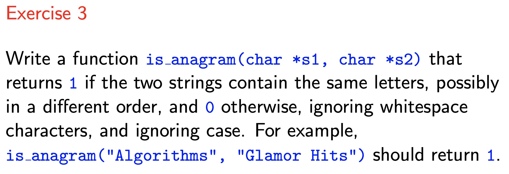

<!-- $theme: default -->

<!-- page_number: true -->

<!-- $size: A4 -->

<script type="text/javascript" async
  src="https://cdnjs.cloudflare.com/ajax/libs/mathjax/2.7.5/latest.js?config=TeX-MML-AM_CHTML">
</script>


# COMP10002 Foundations of Algorithms

## Workshop Week7  

<br>

###### Wenbin Cao
###### September 12, 2019
###### GitHub Repo: https://github.com/AlanChaw/COMP10002-FoA


---

# Outline

## Strings and Arrays
## Question Discussion
## Assignment 1  

---
# Array of Strings
Example: 
```C
char *words[10] = {"Algorithms", "are", "fun"};
int i;
for (i = 0; words[i] != NULL; i++) {
    printf("%s\n", words[i]);
}
```
Output:
```C
Algorithms
are
fun
```
---
# Array of Strings

### Example program of reading input strings into a 2D-array

---
# Inner Functions for Strings

<div align="center">

</div>

---

# Discussion



---

# Discussion




---
# Discussion



---
# Assignment 1


### - Assignment FAQ page
### - Assignment Specification
### - Marking Rubric
### - Submission Instruction
<br>

##### Due on 10am Monday, 23 September