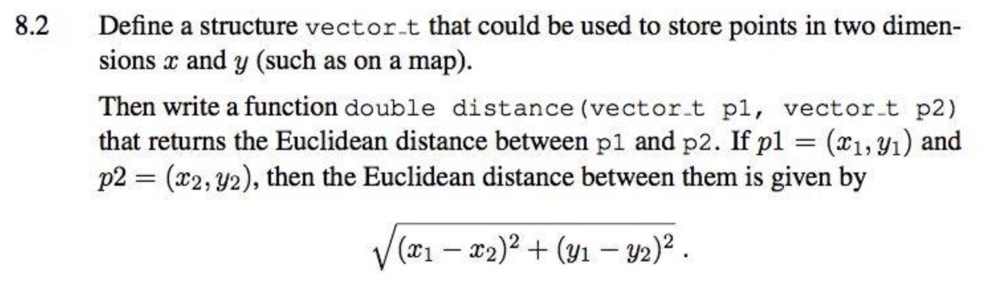

<!-- $theme: default -->

<!-- page_number: true -->

<!-- $size: A4 -->

<script type="text/javascript" async
  src="https://cdnjs.cloudflare.com/ajax/libs/mathjax/2.7.5/latest.js?config=TeX-MML-AM_CHTML">
</script>


# COMP10002 Foundations of Algorithms

## Workshop Week8  

<br>

###### Wenbin Cao
###### September 19, 2019
###### GitHub Repo: https://github.com/AlanChaw/COMP10002-FoA


---

# Outline

## - C typedef
## - struct

---
# typedef

### - Give a type a new name
### - Example
```c
typedef int INTEGER;

INTEGER a, b;
a = 1;
b = 2;
```

```c
#define LENGTH 100
typedef char word_t[LENGTH];

word_t word1 = "myword1";
word_t word2 = "myword2";
```

---
# struct
### - Structure Define and Variable Declaration
### - Structure Operations
- __copy__
- __compare__
- __input & output__
### - Structure with Functions
### - Structure with Pointers
### - Structure with Arrays


---
# struct

### - Managing data via a single variable
### - Define a struct, and declare variables
```C
#define LENGTH 100
typedef struct {
    char name[LENGTH];
    char orbits[LENGTH];
    double distance;
    double mass;
    double radius;
    
} planet_t;

int main(){
    planet_t earth = {"Earth", "Sun", 149.6, 5.9736e+24, 6738.1};
    planet_t moon = {"Moon", "Earth", 0.3844, 7.349e+22, 1738.1};
    
    return 0;
}
```

---
# struct operations
### - copy
```c
planet_t another_planet = earth;
```
### - compare not allowed


---
# struct operations
### - input
```C
planet_t new_planet;

scanf("%s %s %lf %lf %lf",
      new_planet.name,
      new_planet.orbits,
      &new_planet.distance,
      &new_planet.mass,
      &new_planet.radius
      );
```

### - output
```C
printf("name: %s\n", new_planet.name);
printf("orbits: %s\n", new_planet.orbits);
printf("distance: %lf\n", new_planet.distance);
printf("mass: %lf\n", new_planet.mass);
printf("radius: %lf\n", new_planet.radius);
```

---
# struct, function, pointer

### - struct can be pass to a function, it is treated as a scalar variable
### - the changes of struct in a function only changes the local variable
### - to modify a struct in a function, pass its pointer instead
<br>

### - functions can return structure variables

---

# structs and arrays
```C
typedef struct {
    char name[LENGTH];
    int age;
    int math_grade;
    int english_grade;
} student_t;

typedef struct {
    int class_num;
    student_t all_students[MAX_NUM];
} class_t;

typedef struct {
    char school_name[LENGTH];
    class_t all_classes[MAX_NUM];
} school_t;
```
---
# struct
### - Structure Define and Variable Declaration
### - Structure Operations
- __copy__
- __compare__
- __input & output__
### - Structure with Functions
### - Structure with Pointers
### - Structure with Arrays


---
# Exercise




__Hint: You may use the functions in <math.h>__
```c
/* Returns x raised to the power of y. */
double pow(double x, double y);

/* Returns the square root of x. */
double sqrt(double x);
```

---

# Assignment 1

## - Submission
## - General Questions
