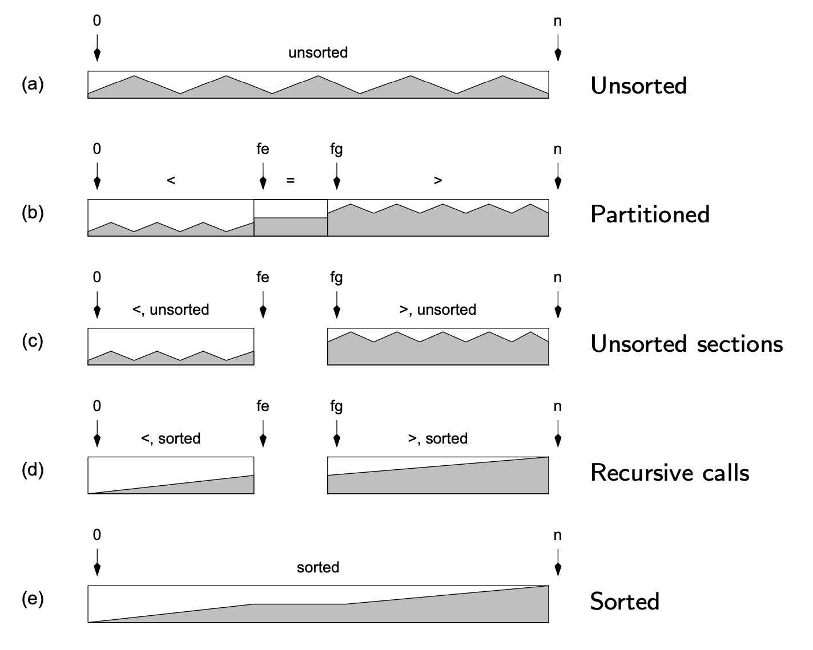
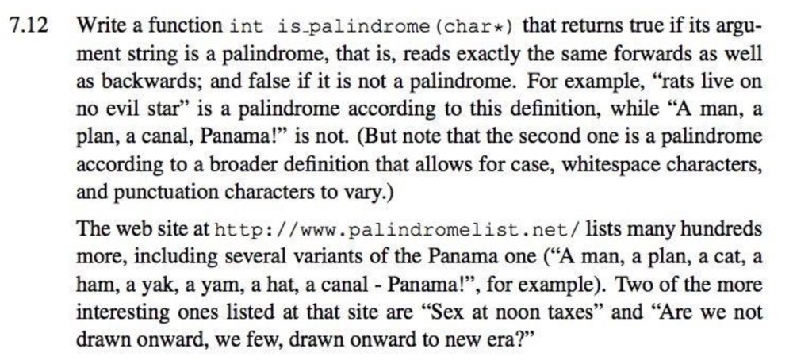
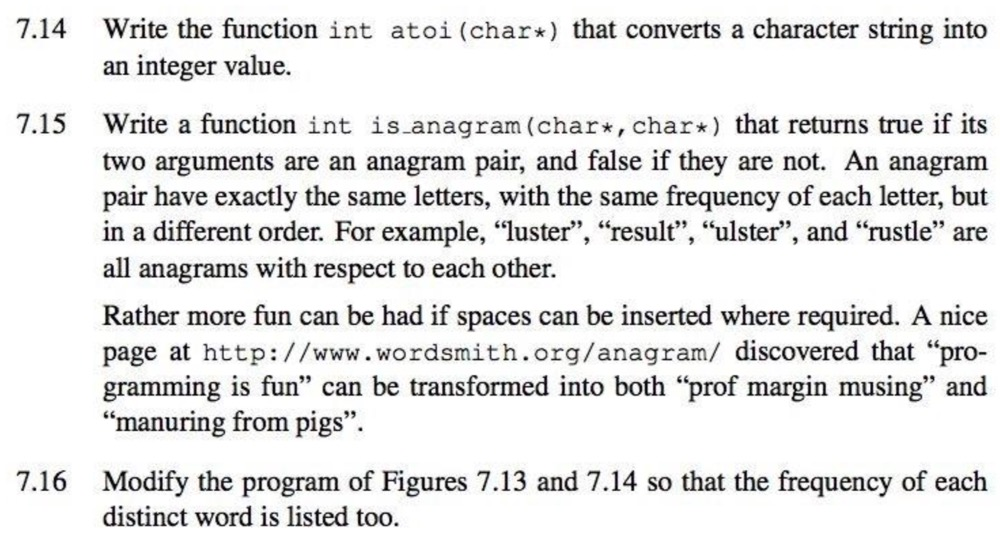

<!-- $theme: default -->

<!-- page_number: true -->

<!-- $size: A4 -->

<script type="text/javascript" async
  src="https://cdnjs.cloudflare.com/ajax/libs/mathjax/2.7.5/latest.js?config=TeX-MML-AM_CHTML">
</script>


# COMP10002 Foundations of Algorithms

## Workshop Week6  

<br>

###### Wenbin Cao
###### August 29, 2019
###### GitHub Repo: https://github.com/AlanChaw/COMP10002-FoA


---

# Recap

## Chapter 12 - Measuring Performance
## Chapter 12 - Quicksort
## Chapter 7 - String  

---

# Measuring Performance

## - Correcrtness
## - Efficiency
- __Time__
- __Space__


---
# Defining Efficiency

__- $O(g(n))$ is a _set_ of functions, including all functions that have the same or smaller growth rate.__

- $f_1(n)=2n$. Then $f_1(n)\in O(n)$.
- $f_2(n)=3n^2+2n+3$. Then $f_2(n)\in O(n^2)$
- $f_3(n)=15n+27\sqrt{n}-e\log{n}$. Then $f_3(n)\in O(n)$

__- It is usual to make use of the _simplest_ such $g(n)$ function__

__- Allows the growth rate of function can be compared__

---
# Time Complexity - Insertion Sort
```C
void sort_int_array(int A[], int n) {
    int i, j;
    for (i=1; i<n; i++) {
        for (j=i-1; j>=0 && A[j+1]<A[j]; j--) {
            int_swap(&A[j], &A[j+1]);
        }
    }
}
```

---

# Quicksort
<div  align="center">    

 

</div>

---

# Partition Example

## 7  &nbsp;&nbsp; 4 &nbsp;&nbsp;  6 &nbsp;&nbsp;  3 &nbsp;&nbsp;  1 &nbsp;&nbsp;  2 &nbsp;&nbsp;  5
## Pivot = 3

---

# Time Complexity - Quick Sort
### - $O(n\log{n})$ time, on average
### - $O(n^2)$ in the worst case, but almost impossible.

---

# String

### - In C, there is no pre-defined string type, instead, we use char [].

```C
char *p = "Hello";   /* cannot be modified */
/* 
char p[6] = {'H','e','l','l','o','\0'};
char p[] = "hello";
*/ 
printf("%s\n", p);
printf("%c\n", *p);
printf("%c\n", *(p+1));
printf("%c\n", p[2]);
```
<div  align="center">    
 
</div>

```C
hello
h
e
l
```
---
# Array of Strings
Example: 
```C
char *words[10] = {"Algorithms", "are", "fun"};
int i;
for (i = 0; words[i] != NULL; i++) {
    printf("%s\n", words[i]);
}
```
Output:
```C
Algorithms
are
fun
```
---
# Read one line of input into a string
```C
int
read_line(char str[], int max) {
    int n=0, c;
    while ((c=getchar()) != EOF && c!='\n') {
        str[n++] = c;
        if (n==max-1) {
            str[n++] = '\0';
            return 1;
        }
    }
    if (c==EOF && n==0) {
        return 0;
    }
    str[n++] = '\0';
    return 1;
}
```
---

# Exercise



---

# Exercise



---

# Exercise 7-14

### For 7-14, you may use function isdigit() in <string.h> to check if a character is a digit:

```C
#include <string.h>

char a = 3;
isdigit(a);   /* return 1 for digit, 0 for not digit */
```

### Convert a character to digit:
```C
char three = '3';
int num = three - '0';  /* num = 3 now */
```