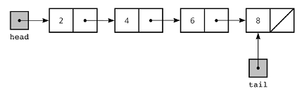
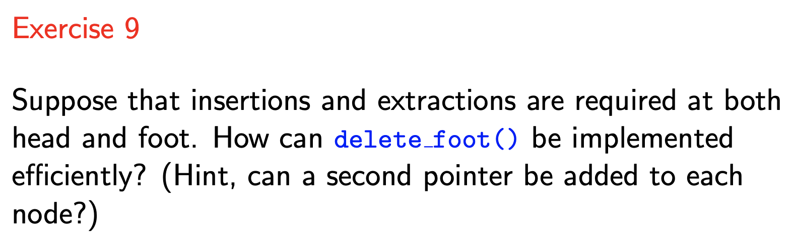
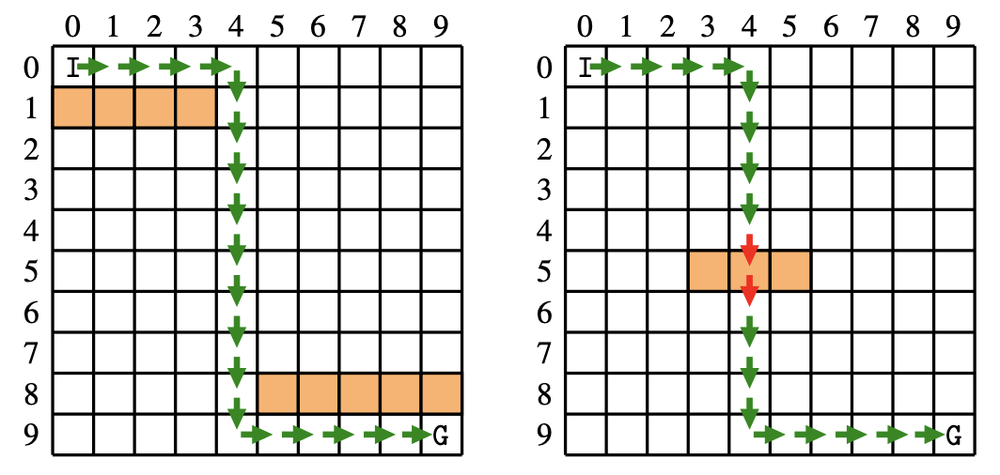
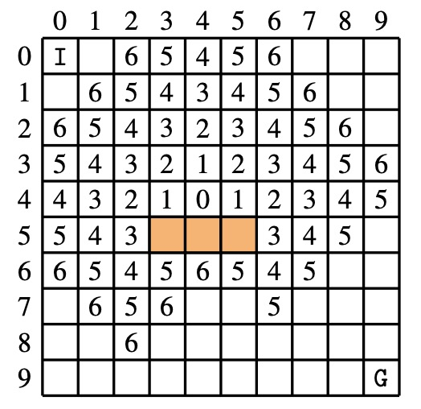
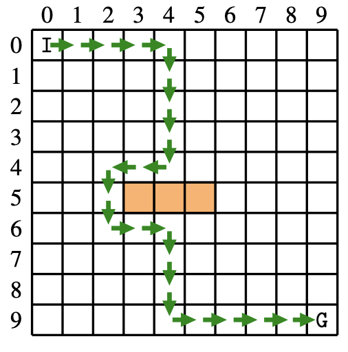

<!-- $theme: default -->

<!-- page_number: true -->

<!-- $size: A4 -->

<script type="text/javascript" async
  src="https://cdnjs.cloudflare.com/ajax/libs/mathjax/2.7.5/latest.js?config=TeX-MML-AM_CHTML">
</script>


# COMP10002 Foundations of Algorithms

## Workshop Week 10  

<br>

###### Wenbin Cao
###### October 10, 2019
###### GitHub Repo: https://github.com/AlanChaw/COMP10002-FoA


---

## Linear Data Structures

##### - Linked Lists
##### - Stacks
##### - Queues

<br>

## Trees
##### - Binary Search Trees

<br>

## Dictionaries


---
# Linked Lists

#### A linked list is a one-dimensional data structure in which objects are threaded together using a pointer in each node. 

<br>

<div align="center">

</div>

---
# Linked Lists

#### Linked list node structure: 
```C
typedef struct node node_t;

struct node {
    data_t data;     /* Representational abstraction */
    node_t *next;
};
```


#### Linked list structure: 
```C
typedef struct {
    node_t *head;
    node_t *foot;
} list_t;
```


---

# Linked Lists

## Four Main Operations (mentioned in the lecture)

##### - Insert before head
##### - Append after tail
##### - Delete head node
##### - Fetch the contents of head

## Comparing with Arrays

---

# Stacks

#### - A stack is a data structure in which the most recently inserted item is returned next.
#### - LIFO  - Last in, first out

#### - Two main operations: push and pop

<div align="center">

</div>

---
# Queue

#### - A queue is a data structure in which the least recently inserted item is returned next. 

#### - FIFO  - First in, first out

#### - Two main operations: enqueue and dequeue

<div align="center">

</div>

---
# Discussion

     	

---

# Discussion



---
# Exercise 9

```C
/* doubly linked list node */
struct node {
    data_t data;
    node_t *next;
    node_t *prev;
};
```
```C
list_t
*delete_foot(list_t *list) {
    node_t *old_foot;
    assert(list!=NULL && list->foot!=NULL);
    old_foot = list->foot;
    list->foot = list->foot->prev;
    if (list->foot==NULL) {
        /* the only list node just got deleted */
        list->head = NULL;
    }
    free(old_foot);
    return list;
}
```


---

# Binary Search Trees

#### - A binary tree is a two-dimensional data structure in which objects are threaded together using two pointers in each node.

<div align="center">

</div>

#### - A binary search tree is a binary tree in which the objects are ordered from left to right across the tree.


---
# Binary Search Trees

```C
typedef struct node node_t;
struct node {
void *data;
node_t *left;
node_t *rght;
};
```
```C
typedef struct {
node_t *root;
int (*cmp)(void*,void*);   /* For polymorphic */
} tree_t;
```

---


# Assignment 2

#### - The algorithm to repair a broken route segment
<div align="center">

</div>

---


# Assignment 2

#### - The algorithm to repair a broken route segment
<div align="center">

</div>

---
# Assignment 2

#### - The algorithm to repair a broken route segment
#### - Visit order: Above, below, left, right

<div align="center">


<b> Queue </b>
	([4, 4], 0)
    
    
</div>

---
#### - Visit order: Above, below, left, right

<div align="center">


<b> Queue </b>
	([4, 4], 0)
    ([3, 4], 1)
    ([4, 3], 1)
    ([4, 5], 1)
    
    
</div>

---
#### - Visit order: Above, below, left, right

<div align="center">



<b> Queue </b>
	([4, 4], 0)
    ([3, 4], 1)
    ([4, 3], 1)
    ([4, 5], 1)
    ([2, 4], 2)
    ([3, 3], 2)
    ([3, 5], 2)
    ([4, 2], 2)
    ([4, 6], 2)
    ...
</div>

---

## Traverse backwards and get the repaired route

<div align="center">


</div>


---

## Traverse backwards and get the repaired route

<div align="center">



</div>


